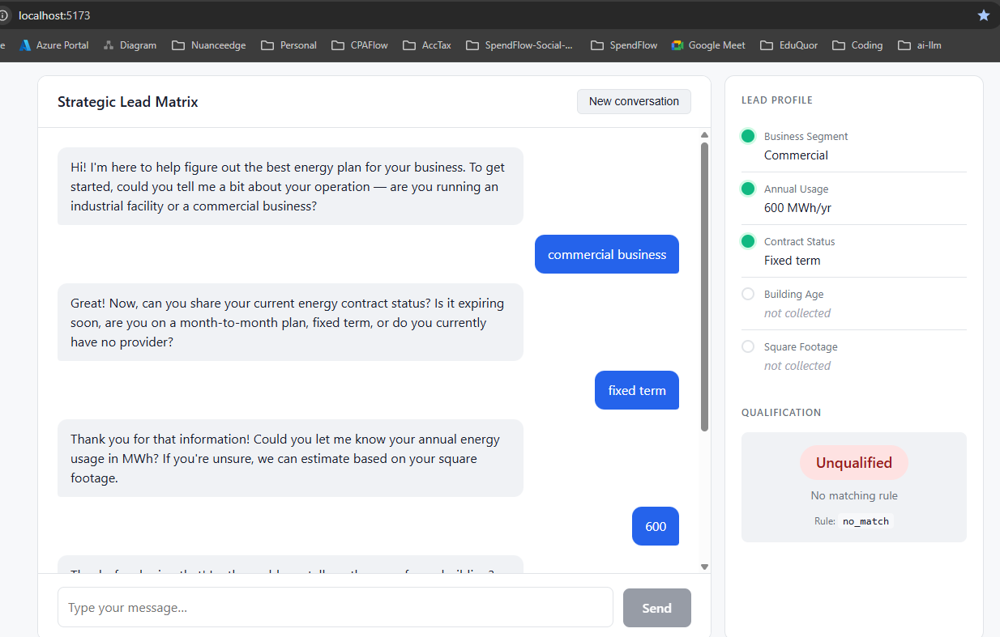
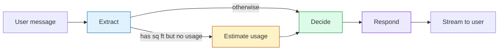

# Strategic Lead Matrix

**🤖 AI-driven commercial energy lead qualification · FastAPI · LangGraph · React · PostgreSQL**



> An autonomous AI agent that qualifies commercial energy leads through natural dialogue and multi-variable decision-making.

Built as a full-stack Proof of Concept combining FastAPI, LangGraph, React, and PostgreSQL, orchestrated by Docker Compose. The agent conducts a discovery conversation, extracts structured data turn-by-turn, applies a deterministic qualification matrix, and streams its reasoning to the frontend in real time.

---

## Quick start

```bash
# 1. Clone and enter the repo
git clone 
cd lead-matrix

# 2. Add your OpenAI API key
# For testing I have already set up my API Key so everything will work as expected
cp .env.example .env
# Edit .env and set OPENAI_API_KEY

# 3. Start the stack
docker compose up --build
```

Once the containers report healthy:

- **Chat interface:** http://localhost:5173
- **API docs (Swagger):** http://localhost:8000/docs
- **Readiness check:** http://localhost:8000/health/ready

Everything runs in containers. No local Python, Node, or Postgres installation required.

---

## What it does

The agent qualifies commercial energy leads into one of four outcomes based on a 5-rule matrix defined in the challenge spec:

| Outcome | Meaning |
|--------|---------|
| **Tier 1** | Instant priority — account exec contacts within a day |
| **Tier 2** | Follow-up within the week |
| **Tier 3** | Nurture — add to long-term content stream |
| **Unqualified** | No rule fits this profile |

A qualifying conversation collects up to 7 variables through natural dialogue — business segment, annual usage, contract status, building age, square footage, company, and contact. The agent handles a specific fallback: when the user doesn't know their annual usage, it pivots to asking for square footage and estimates usage from industry-standard energy-intensity values.

Every interaction is streamed token-by-token to the UI, and the right-hand **debug panel** shows the lead profile filling in live plus the tier decision as it happens.

---

## Architecture overview

```
┌──────────────────┐        SSE stream       ┌────────────────────────────┐
│  React + Vite    │ ◄──────────────────────►│      FastAPI (async)       │
│  TypeScript UI   │    POST /chat/stream    │  ┌──────────────────────┐  │
│  • chat bubbles  │                         │  │  LangGraph agent     │  │
│  • debug panel   │                         │  │  extract → decide →  │  │
│  • SSE client    │                         │  │  estimate → respond  │  │
└──────────────────┘                         │  └──────────┬───────────┘  │
                                             │             ▼              │
                                             │  ┌──────────────────────┐  │
                                             │  │  LLM interface       │  │
                                             │  │  (OpenAI client)     │  │
                                             │  └──────────────────────┘  │
                                             │             │              │
                                             │             ▼              │
                                             │  ┌──────────────────────┐  │
                                             │  │ Async SQLAlchemy     │  │
                                             │  └──────────┬───────────┘  │
                                             └─────────────┼──────────────┘
                                                           ▼
                                             ┌──────────────────────────────┐
                                             │  Postgres 16   +   Redis 7   │
                                             │  5 tables:                   │
                                             │  conversations, messages,    │
                                             │  lead_profiles,              │
                                             │  qualification_events,       │
                                             │  agent_traces                │
                                             └──────────────────────────────┘
```

### Component breakdown

| Component | Stack | Responsibility |
|-----------|-------|----------------|
| **Frontend** | React 18, TypeScript (strict), Vite 5 | Chat UI, SSE consumption, live debug panel |
| **Backend** | FastAPI, async SQLAlchemy 2.0, LangGraph | Agent orchestration, streaming, persistence |
| **LLM** | OpenAI GPT-4o-mini (swappable) | Extraction + conversational responses |
| **Database** | PostgreSQL 16 | Conversations, messages, lead profiles, audit log |
| **Cache** | Redis 7 | Ready for session state / rate limiting |
| **Orchestration** | Docker Compose | One-command bring-up, healthcheck-ordered startup |

See [`docs/architecture.md`](docs/architecture.md) for deeper structural notes and folder layout.

---

## How the agent reasons

The agent is a compiled LangGraph state machine. Each user message runs through these nodes:



- **Extract** — structured JSON extraction from the user's message (GPT-4o-mini with `response_format={"type": "json_object"}`, temperature 0)
- **Estimate** — conditional node, only fires when we have square footage + segment but no usage. Uses EIA CBECS energy-intensity values (15 kWh/sqft for commercial, 30 kWh/sqft for industrial)
- **Decide** — calls the **pure Python** `qualify()` function against the profile. No LLM involved — qualification rules are deterministic business logic
- **Respond** — conversational reply (GPT-4o-mini, temperature 0.7), streamed token-by-token to the frontend

See [`docs/agent-graph.md`](docs/agent-graph.md) for prompt details, state shape, and node implementations.

---

## Design decisions worth calling out

**Qualification is deterministic, not AI-driven.** The matrix rules are pure Python in `app/agent/qualification.py`. Same profile → same tier, every time. The LLM's job is to converse and extract; the rules decide. This gives us reproducibility, exhaustive testability at zero cost, and auditable decisions.

**Two-stage LLM calls per turn.** Extraction is a separate call (JSON mode, temperature 0) from the conversational response (free text, temperature 0.7). Lets us tune each for what it's doing and parallelizes cleanly in the graph.

**LLM client is a Protocol, not a concrete class.** `app/llm/interface.py` defines `LLMClient` as a typing `Protocol`. Swapping from OpenAI to Claude, a local vLLM instance, or a fine-tuned LoRA model is a single-file change. The evaluation suite uses a `FakeLLMClient` that implements the same protocol with canned responses.

**Decorator pattern for observability.** `TracedLLMClient` wraps any `LLMClient` and persists a row in `agent_traces` for every call — prompt, response, latency, token counts. Cross-cutting concerns (tracing, retries, caching) become composable wrappers, not modifications to core clients.

**Alembic migrations auto-apply on container startup.** A custom `entrypoint.sh` runs `alembic upgrade head` before uvicorn, so fresh containers bootstrap their own schema. Reviewers run one command — no manual migration steps.

**Pydantic Settings with fail-fast validation.** Missing or malformed env vars cause uvicorn to refuse to start with a clear error. Can't "work on my machine" past a misconfiguration.

**Request-ID correlation in structured logs.** A `RequestIDMiddleware` assigns a UUID to every HTTP request and propagates it via `ContextVar` into every log line emitted during the request. Logs are JSON (via `structlog`) for machine parsing.

**Selective volume mounts in Docker Compose.** The frontend mounts `src/`, `index.html`, and config files individually — NOT the whole frontend folder. Mounting the full folder would overlay the container's `node_modules` with an empty host directory and break the dev server. A common Docker + Node trap avoided.

---

## Observability

Every agent interaction produces traces across four dimensions:

| Where | What you see |
|-------|-------------|
| **`agent_traces` table** | Every LLM call: prompt, response, latency (ms), prompt/completion tokens, node name |
| **`qualification_events` table** | Every decision: variables collected, estimation applied, tier determined |
| **Structured JSON logs** | Request IDs, node transitions, errors (stdout for log aggregators) |
| **Debug panel (UI)** | Live view of lead profile + tier badge + matched rule |

**Query recent agent activity:**

```bash
# What the agent decided for the last 5 conversations
docker compose exec postgres psql -U app -d leads -c \
  "SELECT status, final_tier, created_at FROM conversations
   ORDER BY created_at DESC LIMIT 5;"

# LLM cost + latency
docker compose exec postgres psql -U app -d leads -c \
  "SELECT node_name, model, prompt_tokens, completion_tokens, latency_ms
   FROM agent_traces ORDER BY created_at DESC LIMIT 10;"

# Decision log for one conversation
docker compose exec postgres psql -U app -d leads -c \
  "SELECT event_type, payload FROM qualification_events
   WHERE conversation_id = '' ORDER BY created_at;"
```

---

## Testing

Three levels, each targeting a different concern:

| Level | Tests | What it proves | Runtime |
|-------|-------|----------------|---------|
| **Unit** | `test_qualification.py` (21 tests) | Pure `qualify()` rules are correct, incl. boundary values (500 vs 501 MWh) | <0.1s |
| **Agent eval** | `tests/eval/` (10 scenarios) | Full agent flow with mocked LLM — extraction → decide → tier | <0.5s |
| **Manual end-to-end** | Real UI at `localhost:5173` | LLM integration works in practice | ~30s per conversation |

Run everything:

```bash
docker compose exec backend pytest tests/ -v
```

Result: **31 tests, 0 failures, 0.34s**.

Scenarios are defined in `tests/eval/scenarios.yaml` — adding a new one requires no Python, just YAML. The runner uses a `FakeLLMClient` that implements the `LLMClient` Protocol and returns pre-scripted responses, so evals are deterministic and free.

---

## Scaling to 1000+ concurrent sessions

A few architectural choices already make this straightforward; the rest is scaling mechanics.

**Already in place:**

- **Stateless FastAPI backend.** No in-memory session state — every turn reads its context from Postgres. Horizontally scalable behind any load balancer.
- **Async all the way down.** uvicorn + FastAPI + asyncpg + async SQLAlchemy + OpenAI AsyncClient. A single Python process handles thousands of concurrent in-flight requests because waits on I/O don't block the event loop.
- **Connection pooling.** `pool_size=10`, `max_overflow=5` per process, `pool_pre_ping=True` for stale-connection resilience.
- **SSE streaming.** Each conversation holds only one active HTTP connection; no persistent WebSocket memory overhead.

**What scaling to 1000 concurrent looks like:**

1. **Horizontal backend.** Run N copies of the backend container behind a load balancer (nginx, ALB, etc.). Each process sustains ~200-400 concurrent streaming connections; 3-5 pods comfortably covers 1000.
2. **Postgres tuning.** Raise `max_connections` to match total pool footprint (e.g., 5 pods × 15 conns = 75, plus headroom). Managed Postgres (RDS, Cloud SQL) handles this without any rearchitecture.
3. **Redis for distributed rate limiting.** Redis is already in the stack, currently unused. The natural next step is per-conversation and per-IP rate limiting using `redis-asyncio`.
4. **Offload LLM pressure.** At sustained 1000 concurrent, OpenAI rate limits will bite before anything else. Mitigations:
   - Route between providers (OpenAI + Anthropic) via the `LLMClient` Protocol
   - Self-host inference for extraction (the cheap JSON-mode call) via vLLM or TGI — extraction is higher-volume but simpler than conversational generation
   - Response caching for canned replies (greetings, tier announcements)
5. **Queue long-running work.** If we add anything agentic that takes >5s (research, external API calls), move to a task queue (Celery, Arq) with Redis as the broker. The current chat turns are <2s so we don't need this yet.
6. **Observability in production.** Ship structured logs to a log aggregator (Loki, Datadog). Add Prometheus metrics at the FastAPI layer for request rate, LLM latency, qualification-rate-by-tier. The `agent_traces` table is already a rich telemetry source.

The architecture is "boring enough" to scale — no in-memory sessions, no sticky routing, no cross-pod coordination required.

---

## Future enhancements

| Area | Possible next step |
|------|--------------------|
| **Human handoff** | Escalate Tier 1 conversations to a live rep with full context preserved |
| **RAG for product info** | Index current pricing / program details; let the agent answer follow-up questions grounded in real policies |
| **Fine-tuning** | Collect labeled conversations → LoRA fine-tune extraction for domain-specific phrasing (billing jargon, regional terminology) |
| **Function calling** | Replace prompt-based extraction with OpenAI function-calling schemas for even stricter output shape |
| **Multi-language** | System prompt variants + detected-language routing |
| **Compliance logging** | Append conversation hashes to an external append-only log (e.g., for financial compliance) |

---

## Repository layout

```
lead-matrix/
├── backend/                          FastAPI backend
│   ├── alembic/                      Database migrations
│   ├── app/
│   │   ├── agent/                    LangGraph agent (state, nodes, graph, runner)
│   │   ├── api/                      HTTP routes (chat, health, debug)
│   │   ├── db/                       Models, session, repositories
│   │   ├── llm/                      LLM interface + OpenAI client + tracing wrapper
│   │   ├── observability/            Structured logging + request IDs
│   │   ├── schemas/                  Pydantic event shapes
│   │   ├── config.py                 Typed settings
│   │   └── main.py                   FastAPI app factory
│   └── tests/
│       ├── test_qualification.py     Pure rule unit tests
│       └── eval/                     YAML-driven agent scenarios
├── frontend/                         React + TypeScript + Vite
│   └── src/
│       ├── api/                      Streaming SSE client
│       ├── components/               ChatWindow, MessageBubble, DebugPanel, etc.
│       ├── hooks/                    useChat
│       ├── styles/                   chat.css
│       └── types/                    Event/message types
├── docs/                             Longer-form docs
├── postgres/                         DB init script
├── docker-compose.yml                Stack orchestration
└── README.md                         You are here
```

---

## License

This is a proof-of-concept submission; no license applied.
