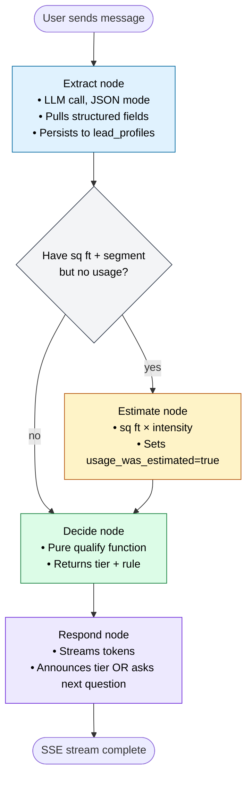

# Agent graph details

Deeper notes on the LangGraph agent powering qualification.

## Full node + edge diagram



## State shape

The agent state is a `TypedDict` defined in `app/agent/state.py`:

```python
class AgentState(TypedDict, total=False):
    conversation_id: UUID
    user_message: str                 # the incoming message
    history: list[dict]               # prior messages, formatted for LLM

    # The 7 profile variables
    business_segment: BusinessSegment | None
    annual_usage_mwh: float | None
    contract_status: ContractStatus | None
    building_age_years: int | None
    square_footage: int | None
    usage_was_estimated: bool

    # Per-turn flags set by extract node
    newly_extracted: dict
    user_said_dont_know: bool

    # Per-turn output
    qualification: QualificationResult | None
    assistant_message: str
    final_tier: LeadTier | None
```

## Node-by-node

### Extract node

**Purpose:** Pull structured data out of the user's natural-language message.

**LLM call:** GPT-4o-mini, temperature 0, `response_format={"type": "json_object"}`.

**Input to LLM:** Extraction system prompt + prior message history + latest user message.

**Output:** A JSON object with any combination of `business_segment`, `annual_usage_mwh`, `contract_status`, `building_age_years`, `square_footage`, and a special `user_said_dont_know` flag.

**Persistence:** Updates `lead_profiles`, records a `VARIABLE_COLLECTED` event.

**Failure mode:** Bad JSON → empty extraction, logged warning. Agent continues by re-asking.

### Estimate node (conditional)

**Purpose:** Derive annual usage when user doesn't know it but has supplied square footage.

**Formula:** `MWh = sq_ft × intensity ÷ 1000`, where intensity is 15 kWh/sq ft for commercial, 30 kWh/sq ft for industrial (EIA CBECS mid-range values).

**Persistence:** Sets `annual_usage_mwh` and `usage_was_estimated=true` on the profile; records `ESTIMATION_APPLIED` event.

**Why it's conditional:** we only want to run it when the exact trigger matches — square footage present, segment present, usage still missing.

### Decide node

**Purpose:** Determine the tier from the current profile.

**Implementation:** Pure Python call to `qualify(QualificationInput(...))`. No LLM. No network.

**Output:** `QualificationResult` with `tier`, `matched_rule`, `is_complete`.

**Why it's pure Python:** see architecture.md for the full rationale. Summary: reproducibility, testability, auditability.

### Respond node

**Purpose:** Generate the next assistant message.

**LLM call:** GPT-4o-mini, temperature 0.7, streaming.

**Behavior branches:**

1. **Qualification complete** — announce the tier using a tier-specific prompt with strong "end the conversation" directives
2. **User said 'don't know'** about usage — pivot to asking about square footage
3. **Missing variables** — ask about the next logical one (segment → contract → usage → building age)

**Persistence:** Saves the full accumulated message to `messages` table. If qualification is complete, updates `conversations.status = QUALIFIED`.

## Prompts

All prompts live in `app/agent/prompts.py` as module-level constants, versioned in git. Two main prompts:

1. **`EXTRACTION_SYSTEM_PROMPT`** — instructs the LLM to output only JSON fields it can explicitly identify from the user message. Includes few-shot examples.
2. **`CONVERSATION_SYSTEM_PROMPT`** — defines the agent persona (friendly, one question at a time, warm, no repetition).

For tier announcements and missing-variable questions, the base conversation prompt is augmented with per-turn hints generated by `_build_response_hints()` in the runner.

## Fallback trigger flow

The "Logic Fallback" from the challenge spec works like this:

1. User: *"We're a commercial office"* → `business_segment=commercial`
2. Agent: *"What's your annual energy usage?"*
3. User: *"I have no idea"* → extraction returns `user_said_dont_know=true`
4. `user_said_dont_know` routes the respond node to the "pivot to square footage" branch
5. Agent: *"No problem — how many square feet is your facility?"*
6. User: *"50,000 sq ft"* → `square_footage=50000`
7. Extract node routes to Estimate node (condition: has sq ft + segment, no usage)
8. Estimate node: `50000 × 15 / 1000 = 750 MWh`, sets `usage_was_estimated=true`
9. Decide node runs with complete info, potentially returns a tier
10. Respond node announces or continues as appropriate

The `usage_was_estimated` flag is displayed in the UI debug panel so reviewers can see the fallback fired.